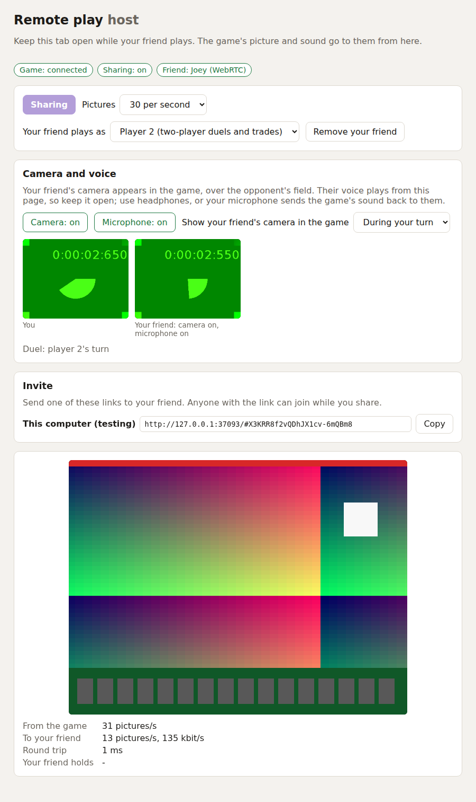
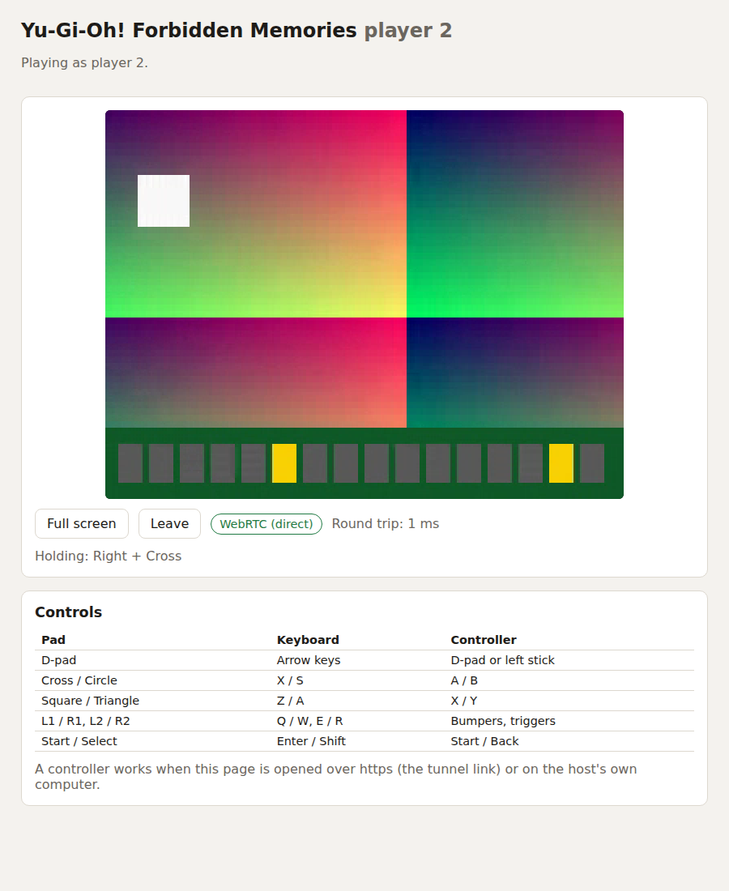

# Remote play companion

Play Yu-Gi-Oh! Forbidden Memories with a friend: the game runs on your PC,
your friend opens a link in their browser and plays as **player 2**. How it
works, and why it is built this way: [notes/remote-play.md](../../notes/remote-play.md).

| Host page (your PC) | Guest page (your friend) |
|---|---|
|  |  |

The pictures show the stand-in game (`npm run fake-game`), not the real one,
and Chromium's fake camera.

## What you need

* The game built from this repository (see the main README) and your disc.
* [Node.js](https://nodejs.org) 20 or later.
* To invite over the internet: [`cloudflared`](https://developers.cloudflare.com/cloudflare-one/connections/connect-networks/downloads/)
  (free, no account needed for its quick tunnels). On your own network you
  need nothing more.

## Play

1. Start the game with the bridge on:

   ```sh
   MEMORIES_REMOTE_PLAY=1 ./play.sh              # Linux
   set MEMORIES_REMOTE_PLAY=1 && play.bat        # Windows (cmd)
   ```

2. Start the companion, in this directory:

   ```sh
   npm install
   npm start -- --tunnel        # over the internet
   npm start -- --lan           # or: your local network only
   ```

   Your browser opens the **host page** (`http://127.0.0.1:8700`).

3. Press **Start sharing**, copy an invite link and send it to your friend.
4. Your friend opens it, types a name and presses **Join the game**.
5. In the game, choose a two-player duel or trade: player 2's pad is
   connected while your friend is in.

The game reads player 2's pad only in its two-player duels and trades. To
let your friend play on every screen (the title, the campaign, duels against
the CPU), pick **Your friend plays as: Player 1** on the host page; you then
share player 1.

### Camera and voice

Both pages have **Camera** and **Microphone** buttons. Your friend's camera
appears in the game window, over the opponent's field, during your turn. Your
camera appears over the field on your friend's page during theirs. Either
side can choose "always in a duel" or "never". Use headphones: the browser
cannot cancel the game's own sound from your microphone. Your friend needs
the tunnel's https link for their camera and microphone. A plain http link
on the local network cannot use them.

Your friend's keys are the PC port's own defaults: arrows, X (Cross),
S (Circle), Z (Square), A (Triangle), Q/W (L1/R1), E/R (L2/R2), Enter (Start)
and Shift (Select). A controller works too when the page is opened through
the tunnel's https link, and phones get an on-screen pad.

### Duel Arena: 1v1 with any deck

Both pages have a **Duel Arena** panel. Each player picks a premade deck
(`decks/*.json`) or builds one from every card of the game, up to three
copies of a card. Then the host chooses **2P DUEL** in the game. No save is
asked for: the arena borrows one save of the host's for both sides and changes
nothing in it. Start the game with `MEMORIES_MOD_DUEL_ARENA=1` as well, and
the title puts **DUEL ARENA** first. How it works:
[notes/duel-arena.md](../../notes/duel-arena.md).

### Options

```
npm start -- --help
```

`--stun` and `--turn` choose the servers WebRTC uses to find a path between
the two browsers. Guests no direct path reaches fall back to a relay through
the companion (pictures and keys, no sound). A link ending in `?relay#...`
uses the relay from the start.

## Develop

```sh
npm run fake-game        # a stand-in for the game, with no disc needed
npm start -- --no-open   # in another terminal; then open http://127.0.0.1:8700
npm test                 # unit and integration tests (against the fake game)
npm run test:e2e         # the whole chain in two real Chromium browsers
```

`npm run test:e2e` uses Playwright's Chromium; `CHROMIUM=/path/to/chrome`
picks another build of Chromium or Chrome.

```
src/server/   the companion: game link, web servers, signalling, tunnel, fake game
src/web/      the host page and the guest page (compiled for the browser)
src/shared/   what both sides use: pad bits and messages
public/       HTML, CSS and the audio worklet
```
